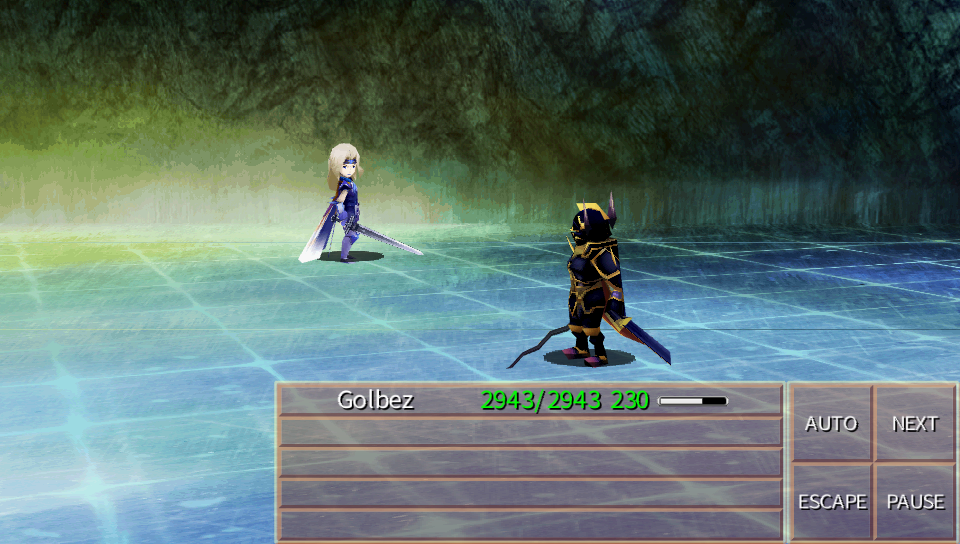

# Final Fantasy 4: The After Years Vita

<p align="center"></p>

This is a wrapper/port of *Final Fantasy 4: The After Years Android* for the *PS Vita*.

The port works by loading the official Android ARMv6 executable in memory, resolving its imports with native functions and patching it in order to properly run.
By doing so, it's basically as if we emulate a minimalist Android environment in which we run natively the executable as is.

## Note

This port (potentially) works with all versions of the game although, it's <b>HIGHLY RECOMMENDED</b> to use the ARMv7 build from v.1.0.10 or later since it's the first version offering an ARMv7 build (which is faster than ARMv6 builds from older versions) and also introduced multithreading making the game run DRASTICALLY faster on PSVita.

## Changelog
### v1.0

- Fixed a bug causing wrong language if Portuguese or Russian were selected in the companion app.
- Added Simplified Chinese language support.
- Added Traditional Chinese language support.
- Added Korean language support.
- Added CRT PostFX effect.
- Added trophies support.

### v0.9

- Added support for v.1.0.10 executable (offering better widescreen support and an HUGE performance boost).
- Updated to latest vitaGL commit.

### v0.8

- Initial Release.

## Known Issues

- Models which appear or leave the scene remain in the position they'd appear or leave for all cutscenes.
- Jumps in overmap have glitched animations.
- When running in overmap for several seconds without interruption, model will stop being animated (only cosmetic).
- Some overworld effects do not properly alter fullscreen tint as they should.
- Since original Android app has no proper full controller support, physical buttons can't be used during battles and in menus.

## Setup Instructions (For End Users)

In order to properly install the game, you'll have to follow these steps precisely:

- Install [kubridge](https://github.com/TheOfficialFloW/kubridge/releases/) and [FdFix](https://github.com/TheOfficialFloW/FdFix/releases/) by copying `kubridge.skprx` and `fd_fix.skprx` to your taiHEN plugins folder (usually `ux0:tai`) and adding two entries to your `config.txt` under `*KERNEL`:
  
```
  *KERNEL
  ux0:tai/kubridge.skprx
  ux0:tai/fd_fix.skprx
```

**Note** Don't install fd_fix.skprx if you're using repatch plugin

- **Optional**: Install [PSVshell](https://github.com/Electry/PSVshell/releases) to overclock your device to 500Mhz.
- Install `libshacccg.suprx`, if you don't have it already, by following [this guide](https://samilops2.gitbook.io/vita-troubleshooting-guide/shader-compiler/extract-libshacccg.suprx).
- Obtain your copy of *Final Fantasy IV: The After Years* legally from the Google Play store in form of an `.apk` file and one or more `.obb` files (usually located inside the `/sdcard/android/obb/com.square_enix.android_googleplay.FF4AY_GP/`) folder. [You can get all the required files directly from your phone](https://stackoverflow.com/questions/11012976/how-do-i-get-the-apk-of-an-installed-app-without-root-access) or by using an apk extractor you can find in the play store. The apk can be extracted with whatever Zip extractor you prefer (eg: WinZip, WinRar, etc...) since apk is basically a zip file. You can rename `.apk` to `.zip` to open them with your default zip extractor.
- Copy the `.obb` file to `ux0:data/ff4a` and rename it to `main.obb`.
- Open the apk and extract `libff4a.so` from the `lib/armeabi-v7a` (or `lib/armeabi` if using a NOT RECOMMENDED older version) folder to `ux0:data/ff4a`.
- Install [FF4AY.vpk](https://github.com/Rinnegatamante/ff4a_vita/releases) on your *PS Vita*.
- **Optional**: For trophies to be unlockable, install [NoTrpDRM](https://github.com/Rinnegatamante/NoTrpDrm).

## Build Instructions (For Developers)

In order to build the loader, you'll need a [vitasdk](https://github.com/vitasdk) build fully compiled with softfp usage.  
You can find a precompiled version here: [Linux](https://github.com/vitasdk/buildscripts/suites/2943994805/artifacts/66184169) / [Windows](https://github.com/vitasdk/buildscripts/suites/2943994805/artifacts/66184170).  
Additionally, you'll need these libraries to be compiled as well with `-mfloat-abi=softfp` added to their CFLAGS:

- [libmathneon](https://github.com/Rinnegatamante/math-neon)

  - ```bash
    make install
    ```

- [vitaShaRK](https://github.com/Rinnegatamante/vitaShaRK)

  - ```bash
    make install
    ```

- [kubridge](https://github.com/TheOfficialFloW/kubridge)

  - ```bash
    mkdir build && cd build
    cmake .. && make install
    ```

- [vitaGL](https://github.com/Rinnegatamante/vitaGL)

  - ````bash
    make SOFTFP_ABI=1 install
    ````

- [opensles](https://github.com/frangarcj/opensles)

  - ````bash
    cd libopensles
    make install
    ````
Finally, you'll need these libraries recompiled with `-mfloat-abi=softfp` from [vitasdk/packages](https://github.com/vitasdk/packages):
- sndfile
- SDL

After all these requirements are met, you can compile the loader with the following commands:

```bash
mkdir build && cd build
cmake .. && make
```

## Credits

- TheFloW for the .so loader which is the core mechanism used for this port.
- frangarcj for FF3_Vita on which this port is heavily based off.
- Darth Bellic for the Livearea assets.
- f2pwn for testing the homebrew extensively.
